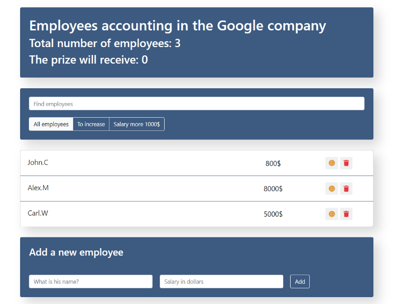

<div align="center">
	<br>
	<h1>Employees Template</h1>
</div>

<!-- PROJECT SHIELDS -->
<div align="center">

   
   
   
   

</div>

<!-- ABOUT THE PROJECT -->
## About The Project



Employees Template is a web application whose main goal is to keep track of company employees. With this application, a user can see how many employees there are in a company and who received a raise. It also allows a user to add, delete, search, and filter employees by specific filters. No matter what the users' needs are, the employees' template allows them to bring together all of the information they need in a single location.

## Built With

* [React](https://reactjs.org/) 
* [Bootstrap](https://getbootstrap.com/) 
* [HTML](https://developer.mozilla.org/en-US/docs/Web/HTML/) 
* [CSS](https://developer.mozilla.org/en-US/docs/Web/CSS/) 

<!-- GETTING STARTED -->
## Getting Started

### Prerequisites

* [Git](https://git-scm.com)
* [Node.js](https://nodejs.org/en/download/)
* [npm](http://npmjs.com)

### Installation

```sh
# Step 1: Clone the repository
$ git clone https://github.com/RadyaBen/Employees-Template.git

# Step 2: Go into the repository 
$ cd Employees-Template

# Step 3: Install NPM packages
$ npm install

# Step 4: Run the app 
$ npm start
```